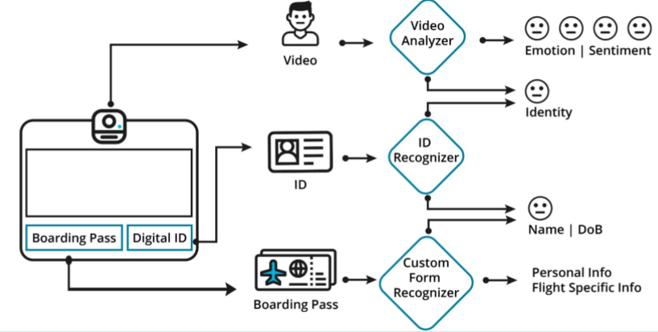
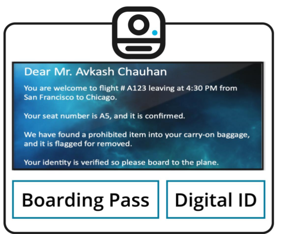
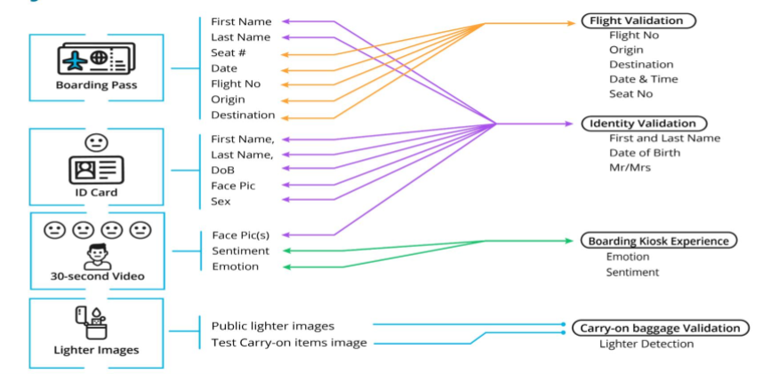
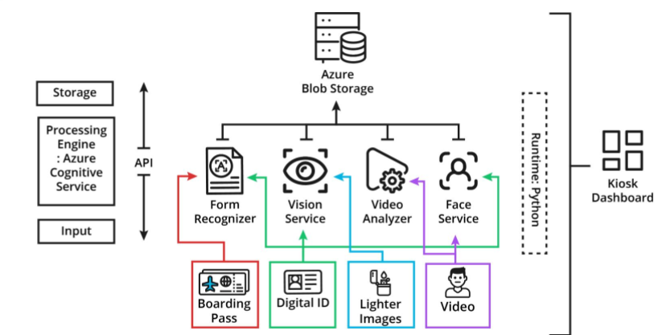

# AI-powered passenger boarding kiosk

## TODO

- [ ] check starter code
- [ ] DVC to track data in blob storage
- [ ] use [Faker](https://github.com/joke2k/faker) to get

  * Flight Number UA-123
  * Carrier Number
  * Flight Origin
  * Destination
  * Flight Date
  * Flight Time
  * Gate Number
  * Boarding Time

- [ ] 5x personal details
  * First Name
  * Last Name
  * Date of Birth
  * Sex
  * Seat Number
  * Face Image - Please use 5 distinct face images, one for each digital ID. One of these face images should be yours. Later in the project, you will perform face verification by comparing the face image on the ID card with the face shown in the 30-second video. Because face verification is done only once, you need to  add your face image to only one ID card.

- [ ] fill out drivers license with image editing


---

## Project brief

> **Goal:** Build an AI-powered boarding kiosk for a fictional airline.



**Key results**



**Data**

The data comprises the following areas:

* flight details (flight number, carrier code, departure, destination, date, time, gate, boarding)
* passenger details (name, birth date, sex, seat, face image)



---

## Getting started


Ensure the following: Azure account, `terraform` (added to PATH), `azure cli`, `Anaconda/Miniconda`, successfully logged into Azure with `az login`.

Additionally, you can download the started code [here](https://github.com/udacity/cd0461-building-computer-vision-solutions-with-azure-project-starter).


```bash
# clone repo
git clone https://github.com/philippschmalen/AI-engineer-passenger-boarding-kiosk.git

# create conda env 'az-sandbox'
conda env create -f conda.yaml
conda activate az-sandbox

# set up pre-commit + hooks
pre-commit install
pre-commit autoupdate

# set up terraform
terraform init
```


---


## Process flow

The kiosk does the following internal processing

* The text data collected from the boarding pass and digital ID is used to cross-reference with the flight manifest to validate flight boarding. There will be more details on this on the Project Starter Material Preparation page. If the page title is truncated on the left-side panel, you can hover your mouse over the page title and see it in full.
* The origin and destination data is used to provide more information about the destination on the kiosk screen
* ID photo validation matched with given photo (extracted from video) - X% above the threshold
* Collect passenger emotion as positive or negative feedback

* Additionally, outside of the scope of the kiosk: Perform the lighter detection from carry-on items

* Finally, upload the data (input and validated) to Azure Blob storage

## Tech

### Libraries

`Faker`

### Infrastructure as code with terraform

To create the necessary resources

```bash
terraform init
terraform fmt
terraform validate
terraform plan
terraform apply -auto-approve
> yes
terraform destroy
```

### Conda

The project uses a conda virtual env. If you add a package, update `conda.yaml` with

```bash
conda env export > conda.yaml --from-history
```

### DVC

Use for data version control

```bash
# set up
dvc init
git commit -m "init dvc"

# add data dir to track
dvc add data
git commit -m "track data dir with dvc"

dvc remote add -d az-storage azure://pspassengerkiosk
dvc remote modify --local az-storage connection_string [ADD CONNECTION STRING]
```

[How to get connection string](https://github.com/iterative/dvc/issues/2200)

### Other



---

## Extensions

- [ ] add tests
- [ ] add github action
