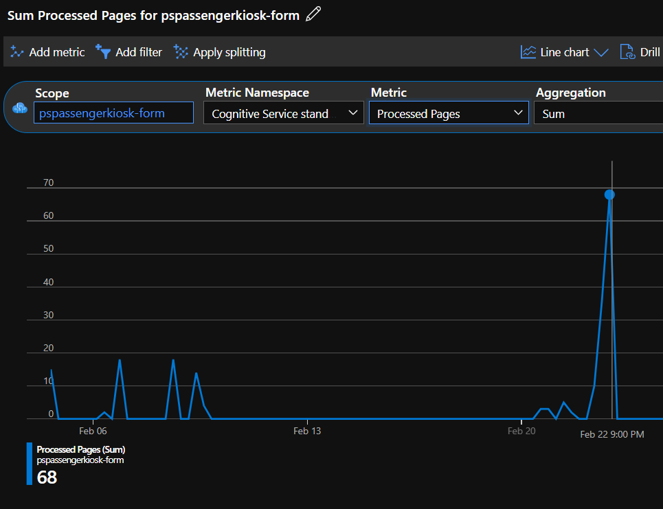

# AI-powered passenger boarding kiosk

Building a fully automated passenger boarding kiosk with `Azure cognitive services`. I apply best practices with **data version control** with `DVC`, **infrastructure as code** with `Terraform` and ensure code quality with `flake8`, `black` and `pre-commit`.


---

## Project brief

### **Problem definition (Objective)**

Build an AI-powered boarding kiosk for a fictional airline.


### **Solution strategy (Key results)**

1. Load image & extract labeled text from ID card
2. Extract image from ID card
3. Load image & extract labeled text from passenger boarding pass
4. Load video & extract face images as thumbnails from video
5. Compare face from video with extracted ID photo
6. Compare ID details (name, dob) with flight manifest
7. Compare boarding pass details (seat, flight time, name) with flight manifest
8. Run object detection for lighter on image of luggage
9. Show message to passenger depending on validations


### **Data**

The submission dataset is found in `./data_projectsubmit`. I excluded

The data comprises the following areas:

* flight details (flight number, carrier code, departure, destination, date, time, gate, boarding)
* passenger details (name, birth date, sex, seat, face image)
* photos taken from https://this-person-does-not-exist.com/en


### **Cognitive services (Architecture)**


### **Data validation**

The `main.py` script runs `pipeline_validate` which takes the prediction outputs from each AI component (cognitive service), checks it against `data/raw/flight_manifest.csv` and writes the validation result in `f"data/validated/flight_manifest_{idx[0]}.csv"`, where `idx[0]` refers to the case id in chronological order.

```python
# validate
passenger_manifest = pipeline_validate(
    flight_manifest,
    dict_id,
    dict_boardingpass,
    dict_face,
    dict_lighter,
)
```

For **lighter detection** the model performance was not sufficient to detect lighters with high certainty. Since lighters count as a dangerous good in aviation, we need a low false negative rate and disregard the passenger experience. Safety is prioritized over comfort. Therefore, I chose a conservative `detect_threshold=0.2` in the `has_no_lighter` function that is part of `pipeline_validate`.

### Usage reports

Screenshots of the Service Consumption Report showing the usage pattern and performance of each Azure cognitive resource.





---


## Submission checklist

- [x] list of python libraries: see `conda.yaml`
- [x] match faces from video and id card: see  `src.utils_data.compare_faces()`
- [x] validation for all passengers: run `main.py` with the data stored in `data/raw/boarding_{name}.pdf`, `data/raw/id_{name}.jpg`, `data/raw/lighter_test_images/lighter_test_set_1of5.jpg`, `data/video/thumbnail/ps-{number}.jpg`
Here is an example output:
```
...
2022-02-22 20:58:26,671 - root - INFO - SUCCESS. Return boardingpass details as dict.
2022-02-22 20:58:27,357 - root - INFO - Faces:
	Reference: f7e625aa-48da-4f46-9d7a-a0e50734d5c9
	Comparing: 1ab47702-6ab8-4fdd-a0db-322d357d0ce7
	identical: False
	confidence: 0.08906
2022-02-22 20:58:27,408 - root - INFO - Created/loaded project 220216-184815.
2022-02-22 20:58:27,410 - root - INFO - Detecting lighters
2022-02-22 20:58:27,734 - root - INFO - Prediction probabilities: {'lighter': [0.2125389, 0.16957963, 0.102686286]}
2022-02-22 20:58:27,740 - root - INFO - Validated: Scott Harrington, 2011-12-26
2022-02-22 20:58:27,743 - root - INFO - Set ['valid_dob', 'valid_name'] True.
2022-02-22 20:58:27,747 - root - INFO - Boarding pass is valid.
2022-02-22 20:58:27,749 - root - INFO - Set valid_boardingpass True.
202 2-02-22 20:58:27,750 - root - INFO - Lighter detected with probability 0.2125389
2022-02-22 20:58:27,754 - root - INFO - Saved validated manifest for Scott Harrington to data/validated/flight_manifest_0.csv
2022-02-22 20:58:27,756 - root - INFO - Flight manifest is valid.

        Dear Scott Harrington,
        You are welcome to flight LH-398 departing at 11:00 from San Francisco to Chicago.
        Your seat number is 14A, and it is confirmed.
        Your identity is verified so please board the plane.


        CAUTION
        We have found a prohibited item in your carry-on baggage, and it is flagged for removal. Please remove it.
```
- [x] See all validation results:


- [x] see error message above
- [x] the validated flight manifest is stored in `./flight_manifest_validated.csv`
- [x] Service consumption report not feasible to get since the Azure account is administered by my employer. Thanks for your understanding.


---

## Get started (developer)


Ensure the following: Azure account, `terraform` (added to PATH), `azure cli`, `Anaconda/Miniconda`, successfully logged into Azure with `az login`.

Additionally, you can download the started code [here](https://github.com/udacity/cd0461-building-computer-vision-solutions-with-azure-project-starter).


```bash
# clone repo
git clone https://github.com/philippschmalen/AI-engineer-passenger-boarding-kiosk.git

# create conda env 'az-sandbox'
conda env create -f conda.yaml
conda activate az-sandbox

# set up pre-commit + hooks
pre-commit install
pre-commit autoupdate

# set up terraform
terraform init
```


### Secrets

Store secrets such as endpoints as environment variables and keys in `.env`, so they can be accessed with `load_dotenv()` and `os.getenv()`.


### DVC

Use the following setup for data version control

```bash
# set up
dvc init
git commit -m "init dvc"

# add data dir to track
dvc add data
git commit -m "track data dir with dvc"

dvc remote add -d az-storage azure://dvc
dvc remote modify --local az-storage connection_string [ADD CONNECTION STRING]
dvc push
```

[How to get connection string](https://github.com/iterative/dvc/issues/2200)


**DVC Workflow**

```bash
# adding files to ./data
dvc add data
dvc push
```

---


## Process flow

The kiosk does the following internal processing

* The text data collected from the boarding pass and digital ID is used to cross-reference with the flight manifest to validate flight boarding. There will be more details on this on the Project Starter Material Preparation page. If the page title is truncated on the left-side panel, you can hover your mouse over the page title and see it in full.
* The origin and destination data is used to provide more information about the destination on the kiosk screen
* ID photo validation matched with given photo (extracted from video) - X% above the threshold
* Collect passenger emotion as positive or negative feedback

* Additionally, outside of the scope of the kiosk: Perform the lighter detection from carry-on items

* Finally, upload the data (input and validated) to Azure Blob storage

### Create data

I synthesize passenger data with `Faker` and collect portraits from https://this-person-does-not-exist.com/en. The `get_data()` method from `src.utils_data.py` generates personal details and flight details. These are stored in `data/raw/flight_manifest.csv` which uploads to Azure blob storage using terraform, `terraform apply -auto-approve`. Find the details in `main.tf::upload-data-raw` resource.


### ID documents

Retrieve ID details with `get_id_details: (form_recognizer_client: FormRecognizerClient, input_img: bytes, verbose=False) -> dict`

Example usage as in `main.py`:

```python
load_dotenv()
AZURE_FORM_RECOGNIZER_ENDPOINT = os.getenv("AZURE_FORM_RECOGNIZER_ENDPOINT")
AZURE_FORM_RECOGNIZER_KEY = os.getenv("AZURE_FORM_RECOGNIZER_KEY")

form_recognizer_client = FormRecognizerClient(
    AZURE_FORM_RECOGNIZER_ENDPOINT, AzureKeyCredential(AZURE_FORM_RECOGNIZER_KEY)
)

# load img as bytes
input_img = load_img(filepath="data/raw/id_amybennett.jpg")
# get id details
dict_id = get_id_details(form_recognizer_client, input_img)
```

Here is the output compared to the input:


### Boarding pass

To train a customer form recognizer, the text fields have to be labelled using the `form OCR testing tool` (FOTT): https://fott-2-1.azurewebsites.net/


Boarding pass and label content link to an azure blob storage:


Next, we train a custom model on the labelled documents:


Example usage as in `main.py`:

```python
# BOARDING PASS
input_img_boardingpass = load_img(
    filepath="data/raw/boarding_amybennett.pdf"
)
get_url = get_url_boardingpass(
    input_img_boardingpass,
    apikey=AZURE_FORM_RECOGNIZER_KEY,
    endpoint=AZURE_FORM_RECOGNIZER_ENDPOINT,
    model_id=AZURE_FORM_RECOGNIZER_MODEL_ID,
)
dict_boardingpass = get_dict_boardingpass(
    get_url=get_url, apikey=AZURE_FORM_RECOGNIZER_KEY
)
print(dict_boardingpass)
```

Here is how the output looks like with an example boarding pass:


### Face recognition

#### Prerequisites


1. Create a `video analyzer for media` in the azure console. Terraform does not support it yet, as of writing (https://github.com/hashicorp/terraform-provider-azurerm/issues/14767)
2. Get the [account ID](https://docs.microsoft.com/en-us/azure/azure-video-analyzer/video-analyzer-for-media-docs/video-indexer-use-apis#account-id) and copy into `.env` as `AZURE_VIDEO_ANALYZER_ACCOUNT_ID`
3. Upload a video to `azure video analyzer for media` (https://www.videoindexer.ai). Get the `video id` by selecting the video and copying the last part of thr URL, such as `https://www.videoindexer.ai/accounts/[account id]/videos/[video-id]`.


Following the sample code on https://github.com/Azure-Samples/cognitive-services-quickstart-code/blob/master/python/Face/FaceQuickstart.py


---

## Tech

### Libraries

`Faker`

### Infrastructure as code with terraform

To create the necessary resources

```bash
terraform init
terraform fmt
terraform validate
terraform plan
terraform apply -auto-approve
> yes
terraform destroy
```

### Conda

The project uses a conda virtual env. If you add a package, update `conda.yaml` with

```bash
conda env export > conda.yaml --from-history
```


### Other


---

## Extensions

- [ ] add unit tests
- [ ] add integration tests
- [ ] add test coverage
- [ ] make architecture diagram
- [ ] add github action
- [ ] use pydantic to validate
- [ ] refactor `train_person_model()` into `create_person_group()` and `train_person_model()`
- [ ] handle multiple matches of Id name: Insert booking code
- [ ] refactor: person class that holds attributes
- [ ] refactor: boarding pass `get_url` into OCR pipeline


## Flight manifest reference

|    | flight_number   | flight_date   | flight_time   | origin    | destination   | name             | sex   | birthdate   | seat   | valid_dob   | valid_person   | valid_luggage   | valid_name   | valid_boardingpass   |
|---:|:----------------|:--------------|:--------------|:----------|:--------------|:-----------------|:------|:------------|:-------|:------------|:---------------|:----------------|:-------------|:---------------------|
|  0 | LH-398          | 2022-01-15    | 11:00         | Frankfurt | Salzburg      | Scott Harrington | M     | 12/26/2011  | 14A    | False       | False          | False           | False        | False                |
|  1 | LH-398          | 2022-01-15    | 11:00         | Frankfurt | Salzburg      | Kevin Lee        | M     | 02/22/1935  | 4A     | False       | False          | False           | False        | False                |
|  2 | LH-398          | 2022-01-15    | 11:00         | Frankfurt | Salzburg      | Amy Bennett      | F     | 02/22/1963  | 2E     | False       | False          | False           | False        | False                |
|  3 | LH-398          | 2022-01-15    | 11:00         | Frankfurt | Salzburg      | Jason Lewis      | M     | 11/09/1950  | 9B     | False       | False          | False           | False        | False                |
|  4 | LH-398          | 2022-01-15    | 11:00         | Frankfurt | Salzburg      | Philipp Schmalen | M     | 09/02/1990  | 24F    | False       | False          | False           | False        | False                |


---

## Final reflections

The project requires that different azure services interplay nicely. It exemplifies how azure services can be creatively combined to solve a real-world problem.

The goal was to build an automated passenger boarding kiosk. A passenger uses it previous to boarding a plane. Nevertheless, it should be more seen as a proof-of-concept and lacks several steps towards going to production.

Heres is a non-exclusive list of concluding thoughts and missing elements to productionize the solution:

* Checking of dangerous goods cannot be verified at boarding, but at the security check. Additionally, the baggage images taken from passengers themselves will be noisy due to lack of standardization. The object detection then will output too many false positives which downgrades customer experience.
* Check regulations regarding boarding. Regulators possibly require a high accuracy to identify passengers.
* Design the customer journey around the automated boarding kiosk to minimze user effort, keep low room for error and optimize the boarding flow.
* Build CICD with testing.
* Automatically pull flight manifest shortly before boarding.
* Train form recognizer on 80-90% of all available country specific id-cards. Edge cases should be marked and handled manually.
* Automate the video processing and thumbnail generation.
